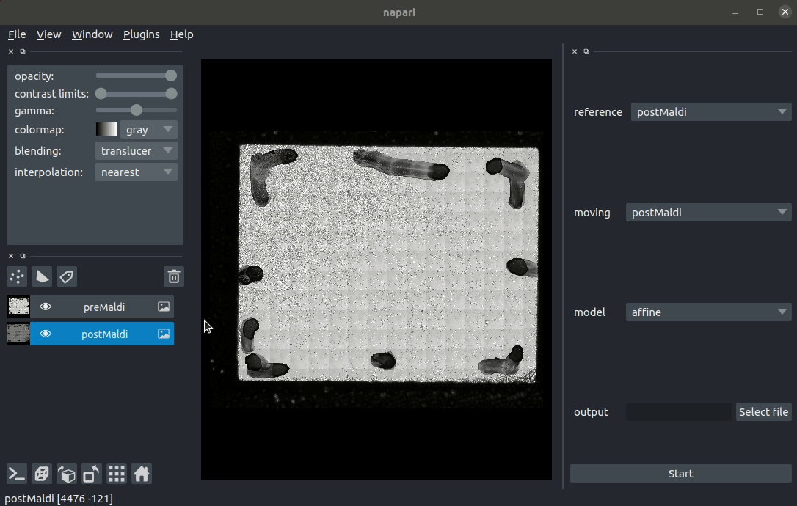

# affinder

[](https://github.com/napari/affinder/raw/main/LICENSE)
[](https://pypi.org/project/affinder)
[](https://python.org)
[](https://github.com/jni/affinder/actions)
[](https://codecov.io/gh/jni/affinder)

Quickly find the affine matrix mapping one image to another using manual correspondence points annotation

----------------------------------

This [napari] plugin was generated with [Cookiecutter] using with [@napari]'s [cookiecutter-napari-plugin] template.

<!--
Don't miss the full getting started guide to set up your new package:
https://github.com/napari/cookiecutter-napari-plugin#getting-started

and review the napari docs for plugin developers:
https://napari.org/docs/plugins/index.html
-->

## Installation

You can install `affinder` via [pip]:

    pip install affinder


## How to use

Affinder is a napari plugin for quickly determining an affine transformation that can be used to register two images from a few manual point annotations.

After installing `affinder` via pip, it should be in your `PATH` and you can launch it from the command line

```sh
$ affinder
```


The registration process consists of three steps: image loading and setup, initial registration, and registration refinement. In the following we outline the steps and show short demonstrations [on an example image pair](./example_data/about_example.md).

1. **Image loading and setup.**
Load the two image images to be registered into napari using
_Open Files(s)_ from the _File_ menu. You can toggle the visibility of the layers or reorder them to see both images.
In the affinder panel on the right select the layer with the reference image (this will remain fixed) and the moving image to be superimposed on the reference image. You can choose between several transform options, in this example we proceed with the default choice of an affine transformation. Specify the name ouf the output file in which the values of the transformation matrix will be stored. Note that one of the two images in this example is flipped across the x-axis.

1. **Initial registration.** In the affinder panel, press the start button. Two new point layers will appear in the layer panel on the left and the visibilty will switch to the reference image.  Now you have to create three points in the new point layer corresponding to the reference image. After creating the third point, the layer visibility automatically changes to the moving image and the corrsponding point layer becomes active. Now annotate the three corresponding points in the moving image, ensuring that you add them in the same order as you did in the reference image. (For volumes or other transformations, the initial number of point pairs required may be more than three.) As soon as enough control point pairs have been added to determine an initial transformation, the transformation will be applied in the viewer and the
annotation mode changes to registration refinement.


1. **Registration refinement**. During this phase of the annotation, the visibility of the reference layer and the active point layer for annotation are toggled automatically after an additional point is added. With each new point pair, the affine transform is updated and applied in the viewer.. When you are happy with the result, click the Finish button.

Practical tips:

* For a good initial affine estimate, try and find control points close to three corners of an image. You want to avoid situations where the control points all lie close to a single line (degenerate case) or very close to each other (this does not constrain the possible transforms well.)
* Once the initial transform has been applied in the viewer, use the opactity slider of the image layers to blend both layers. This will quickly reveal problem areas in the images where the registration is not good. Try and improve the registration by adding control point pairs in these areas.
* Make sure to mark the points accurately and try not to introduce mis-matching poit pairs. While the transformation estimation can tolerate a certain number of outliers, it is best to avoid them. During the recording of the examples above I added the points too quickly and slightly inaccurate leading to less than perfect registration. 

## Contributing

Contributions are very welcome. Tests can be run with [tox], please ensure
the coverage at least stays the same before you submit a pull request.

## License

Distributed under the terms of the [BSD-3] license,
"affinder" is free and open source software

## Issues

If you encounter any problems, please [file an issue] along with a detailed description.

[napari]: https://github.com/napari/napari
[Cookiecutter]: https://github.com/audreyr/cookiecutter
[@napari]: https://github.com/napari
[MIT]: http://opensource.org/licenses/MIT
[BSD-3]: http://opensource.org/licenses/BSD-3-Clause
[GNU GPL v3.0]: http://www.gnu.org/licenses/gpl-3.0.txt
[GNU LGPL v3.0]: http://www.gnu.org/licenses/lgpl-3.0.txt
[Apache Software License 2.0]: http://www.apache.org/licenses/LICENSE-2.0
[Mozilla Public License 2.0]: https://www.mozilla.org/media/MPL/2.0/index.txt
[cookiecutter-napari-plugin]: https://github.com/napari/cookiecutter-napari-plugin
[file an issue]: https://github.com/jni/affinder/issues
[napari]: https://github.com/napari/napari
[tox]: https://tox.readthedocs.io/en/latest/
[pip]: https://pypi.org/project/pip/
[PyPI]: https://pypi.org/
